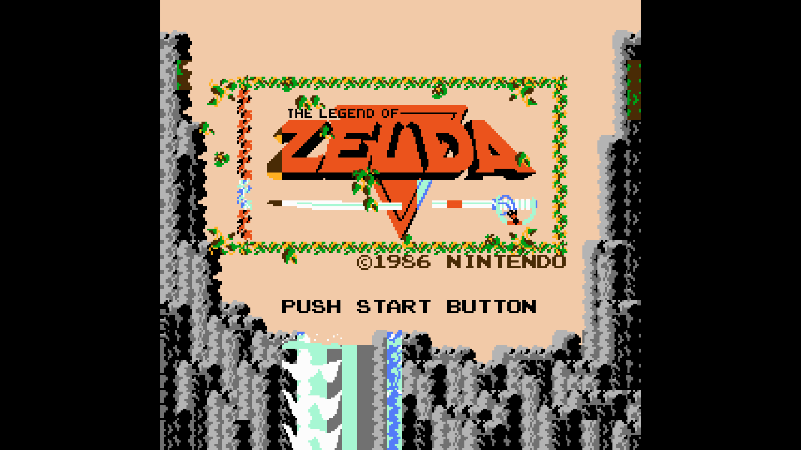
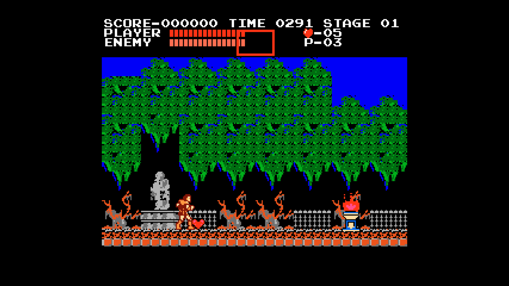
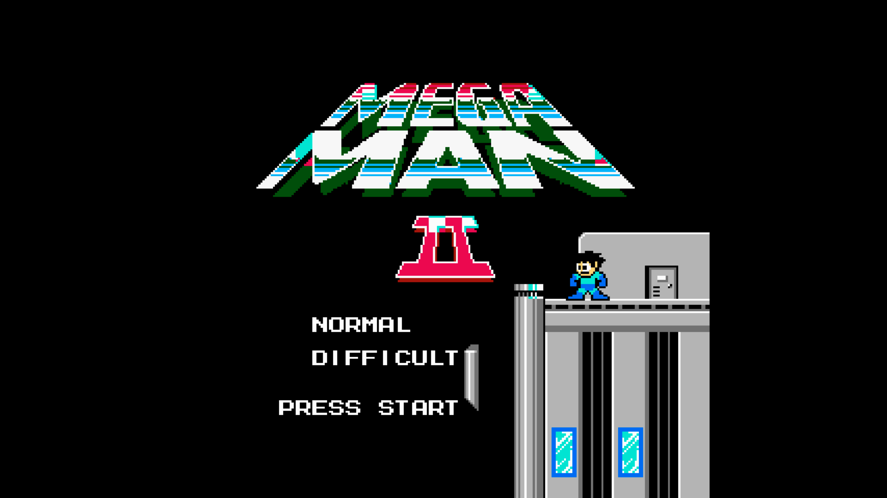
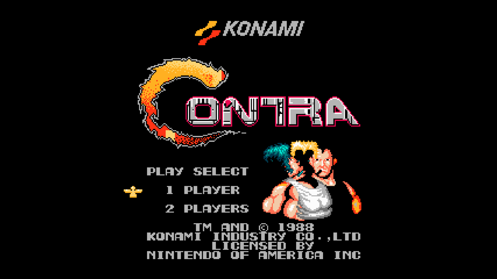
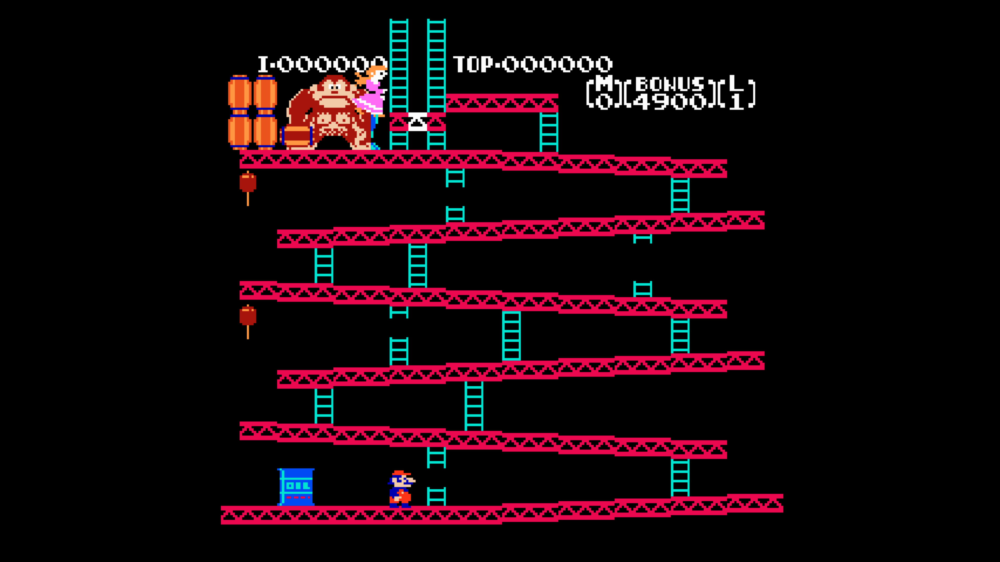

# Alphanes NES Emulator


Alphanes is a Nintendo Entertainment System (NES) emulator written in Go. It aims to emulate the NES hardware, allowing users to play classic NES games on modern computers.

This project was originally developed by Jonathan da Silva Santos between 2014-2015.

## Screenshots

<div align="center">
  
  
  
  
  
</div>

## Features

Alphanes includes implementations for several key NES components:

* **CPU (Ricoh 2A03):** Full 6502-based processor emulation with NTSC timing (1.789773 MHz)
* **PPU (Picture Processing Unit):** Accurate scanline-based rendering with background and sprite support
* **APU (Audio Processing Unit):** Implementation of all sound channels (Pulse, Triangle, Noise, DMC)
* **Mappers:** Support for popular mappers (NROM, MMC1, UNROM, MMC3)
* **Input:** Keyboard controls for standard NES inputs

## Building and Running

### Prerequisites

1. **Go Compiler:** Ensure you have a recent version of Go installed (https://golang.org/doc/install)
2. **SDL2 Development Libraries:**
   * **Ubuntu/Debian:** `sudo apt-get install libsdl2-dev`
   * **macOS (Homebrew):** `brew install sdl2`
   * **Windows (MSYS2/MinGW):** Use `pacman` to install the `mingw-w64-x86_64-SDL2` package
3. **PortAudio Development Libraries:**
   * **Ubuntu/Debian:** `sudo apt-get install portaudio19-dev`
   * **macOS (Homebrew):** `brew install portaudio`
   * **Windows (MSYS2/MinGW):** Use `pacman` to install the `mingw-w64-x86_64-portaudio` package

### Installation

1. Clone the repository:
   ```bash
   git clone https://github.com/jonathandasilvasantos/2014-alphanes-nintendo-emulator
   cd ./2014-alphanes-nintendo-emulator
   ```

2. Clone dependencies:
   ```bash
   sh clone_dependencies.sh
   ```

3. Set up the Go environment:
   ```bash
   source setup.sh
   ```
   This disables GO modules and sets the GOPATH to the current directory.

4. Build the emulator:
   ```bash
   cd ./src/zerojnt/alphanes/
   go build
   ```

### Running

To play a game, simply run:

```bash
./alphanes path/to/your/rom.nes
```

Optional debugging features:
```bash
# For CPU state comparison
./alphanes nestest.nes nestest.log

# For PPU dump analysis
./alphanes your_game.nes your_game_dump.ppu
```

## Controls

| NES Button | Keyboard       |
|------------|----------------|
| A          | Z              |
| B          | X              |
| Select     | Space          |
| Start      | Return (Enter) |
| Up         | Up Arrow       |
| Down       | Down Arrow     |
| Left       | Left Arrow     |
| Right      | Right Arrow    |
| Quit       | Escape         |

## Current Status & Limitations

* Support for multiple mappers, but some edge cases may not be fully implemented
* Audio emulation includes all channels but may have accuracy limitations
* Controller support limited to keyboard input for Player 1
* Performance optimized for most games but complex titles may run slower

## License

Alphanes is free software, distributed under the GNU General Public License v3.0. See the LICENSE file for more details.

## Author

Jonathan da Silva Santos (Original Author, 2014-2015)